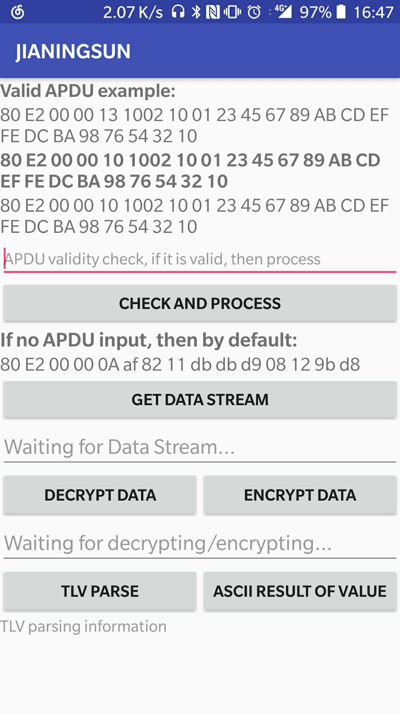
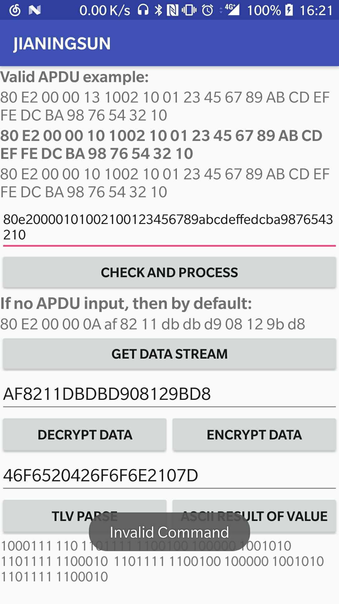
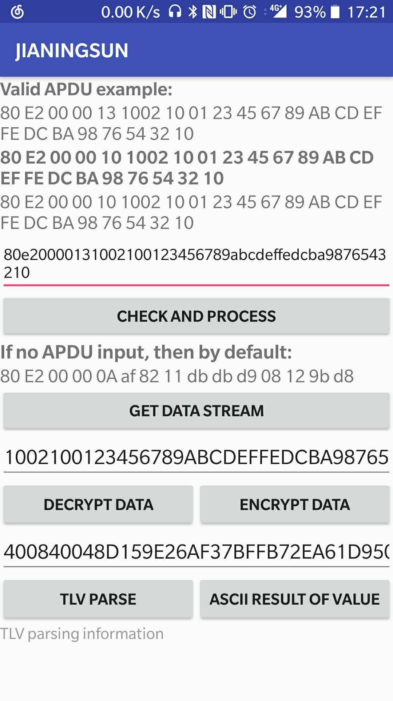
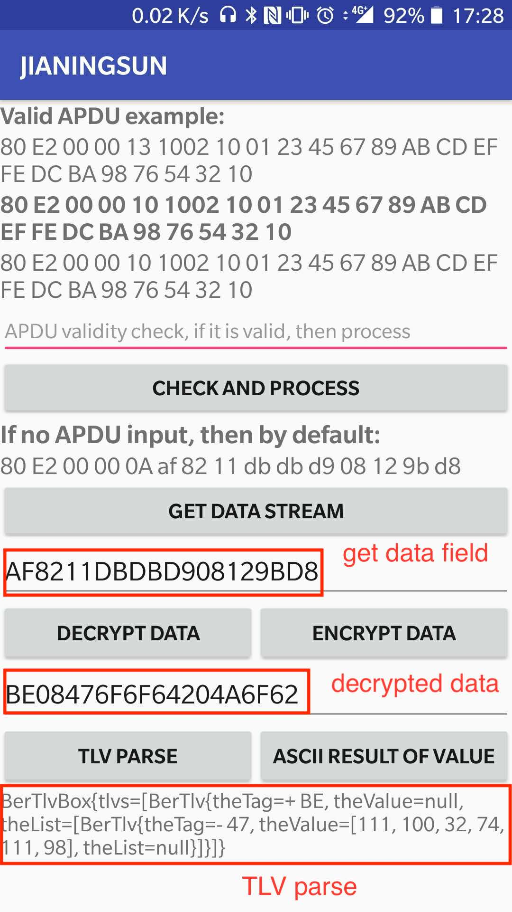
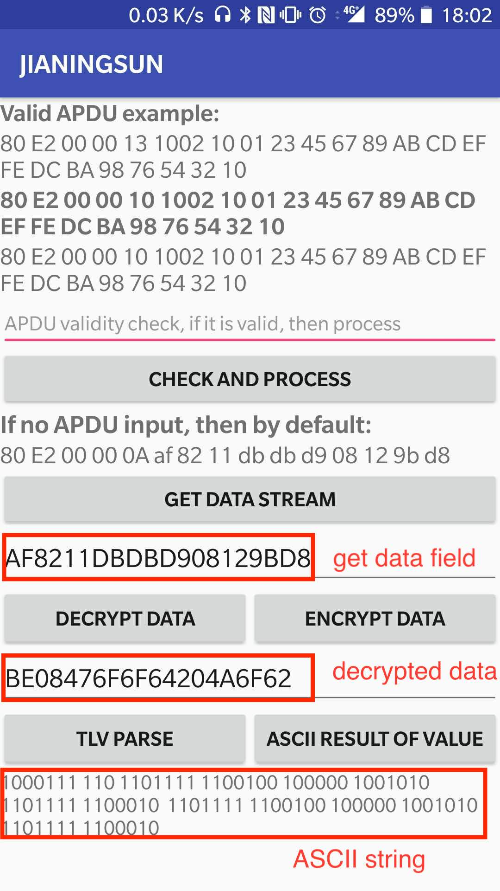

# Javacard Embedded Test - Jianing Sun
## Java Mechanisms in Embedded Context
* Java is a general purpose programming technology based on statically typed object oriented. JVM 
(java Virtual Machine) is useful when it comes to embedded system. Becase Java program source files
are compiled into a well-defined assembly code specified for JVM which virtualizes the underlying 
execution architecture. The association of an object-oriented programming language and of a virtual
provides many key benefits.  
* Java mainly borrows its syntax from C, but uses OOP paradigm that supports a dual paradigm (OOP like 
Java and imperative like C).  
* GC (Garbage collector) is also a powerful tool for embedded with Java. Data memory management is 
automatic and controlled by the garbage collector. The GC can be considered a memory optimizer that 
maximizes data memory availability during program execution. 
* Multi-threading is another important feature. Both the Java language and the virtual machine offer
simple built-in mechanisms, like thread management and synchronization for mutual exclusive access of
code blocks and reliable communication between threads.  
* Embedded & Simulated Java Platform: Java platform is standardized by a well-defined execution model
and software APIs, and it separates the hardware, drivers and virtual processor from the software
application layers.

## Instruction of the Android Application
1. Below is the main view of this application. From the requirements of this app, there are mainly
three parts (from top to bottom): 
* First part used to check and process user input command APDU - check command validity first, 
if it is valid, then process it for the next de/encryption and TLV parse.
* After getting the data stream of APDU, second part used to decrypt or encrypt the command. Decryption means 
cyclic left shift 2 bits, and encryption means cyclic right shift 2 bits.
* Thid part is the TLV parse part. It can parse the decrypted data and return with its tag-length-value information.
For our requirment, I also process different values into ASCII string and display it in the view.   

One thing need to pay attention to is that for a TLV stream, it probably embedded with several TLVs inside, 
for example, our given example for TLV parsing. (I'll show the result of that later)
<!-- <div align="center">
                                                                            
</div> -->

<table sytle="border: 0px;">
<tr>
<td></td>
</tr>
</table>

2. If user input an invalid command APDU, there would be a Toast showing that this is invalid. 
* If user input is invalid or no input, it would encrypt, decrypt and TLV parse the default given APDU strem:
80 E2 00 00 0A af 82 11 db db d9 08 12 9b d8. Otherwise it would process the input valid command APDU. 
* If user input is valid, then it would process the valid command APDU.
<!-- <div align="center">
  
                                                                                                     
</div> -->
<table sytle="border: 0px;">
<tr>
<td></td>
<td></td>
</tr>
</table>

3. Using all the classes (APDU, de/encryption, TLV parse), display the result of parsing the 
given byte stream:   
`80 E2 00 00 0A af 82 11 db db d9 08 12 9b d8`
This is an APDU with an encrypted TLV in its data field.  
a) Get the data field from the apdu 
b) decrypt data -> decrypted data is a TLV   
c) parse TLV (1 byte long tag) 

* This app can display both the **parsing information** and the **ASCII string** of values. 

* **Explanation for the parsing information which displayed in the view of the app:** After decrpting, the TLV is   
`BE 08 47 06 6F 64 20 4A 6F 62`. The first tag is `BE`, whose constructed flag is True as its sixth bit is 1. That means this is a constructed TLV which contains another TLV inside. The second tag is `47` with value length `06`, therefore the value for second TLV is `6F 64 20 4A 6F 42`.

 
<!-- <div align="center">
                                                                                                              
  
</div> -->

<table sytle="border: 0px;">
<tr>
<td></td>
<td></td>
</tr>
</table>

4. Result of parsing the given long TLV  
* Input TLV:
```
61 0A 4F 08 A0 00 00 01 51 00 00 00 61 0E 4F 0C A0 00 00 01 51 53 50 41 53 4B 4D 53 61 10 4F 0E A0   
00 00 01 51 53 50 41 4C 43 43 4D 41 4D 61 10 4D 0E A0 00 00 01 51 53 50 41 4C 43 43 4D 44 4D 61 0F    
4F 0D A0 00 00 01 51 53 50 41 53 33 53 53 44 61 0C 4F 0A A9 A8 A7 A6 A5 A4 A3 A2 A1 A0 61 0C 4F 0A    
A9 A8 A7 A6 A5 A4 A3 A2 A1 A1 61 0E 4F 0C A0 00 00 00 03 53 50 42 00 01 42 01 61 0E 4F 0C A0 00 00    
01 51 53 50 43 41 53 44 00 61 0B 4F 09 A0 00 00 01 51 41 43 4C 00 61 12 4F 10 A0 00 00 00 77 01 07  
82 1D 00 00 FE 00 00 02 00 61 12 4F 10 A0 00 00 02 20 53 45 43 53 45 53 50 52 4F 54 31 61 12 4F 10    
A0 00 00 02 20 53 45 43 53 54 4F 52 41 47 45 31 61 12 4F 10 A0 00 00 02 20 15 03 01 03 00 00 00 41    
52 41 43 61 0C 4F 0A A0 A1 A2 A3 A4 A5 A6 A7 A8 A9 61 0C 4F 0A A0 A1 A2 A3 A4 A5 A6 A7 A8 AA 61 12    
4F 10 A0 00 00 00 77 02 07 60 11 00 00 FE 00 00 FE 00 61 0B 4F 09 A0 00 00 01 51 43 52 53 00
```
* After parsing:
```
BerTlvBox{tlvs=[BerTlv{theTag=+ 61, theValue=null, theList=[BerTlv{theTag=- 4F, theValue=[-96, 0, 0,   
1,  81, 0, 0, 0], theList=null}]}, BerTlv{theTag=+ 61, theValue=null, theList=[BerTlv{theTag=- 4F,   
theValue=[-96, 0, 0, 1, 81, 83, 80, 65, 83, 75, 77, 83], theList=null}]}, BerTlv{theTag=+ 61, theValue  
=null, theList=[BerTlv{theTag=- 4F, theValue=[-96, 0, 0, 1, 81, 83, 80, 65, 76, 67, 67, 77, 65, 77],   
theList=null}]}, BerTlv{theTag=+ 61, theValue=null, theList=[BerTlv{theTag=- 4D, theValue=[-96, 0, 0,  
1, 81, 83, 80,65, 76, 67, 67, 77, 68, 77], theList=null}]}, BerTlv{theTag=+ 61, theValue=null, theList  
=[BerTlv{theTag=- 4F, theValue=[-96, 0, 0, 1, 81, 83, 80, 65, 83, 51, 83, 83, 68], theList=null}]},   
BerTlv{theTag=+ 61,theValue=null, theList=[BerTlv{theTag=- 4F, theValue=[-87, -88, -89, -90, -91, -92,  
-93, -94, -95, -96],theList=null}]}, BerTlv{theTag=+ 61, theValue=null, theList=[BerTlv{theTag=- 4F,   
theValue=[-87, -88, -89,-90, -91, -92, -93, -94, -95, -95], theList=null}]}, BerTlv{theTag=+ 61, the  
Value=null, theList=[BerTlv{theTag=- 4F, theValue=[-96, 0, 0, 0, 3, 83, 80, 66, 0, 1, 66, 1], theList  
=null}]}, BerTlv{theTag=+ 61,theValue=null, theList=[BerTlv{theTag=- 4F, theValue=[-96, 0, 0, 1, 81,  
83, 80, 67, 65, 83, 68, 0], theList=null}]}, BerTlv{theTag=+ 61, theValue=null, theList=[BerTlv{the  
Tag=- 4F, theValue=[-96, 0, 0, 1, 81,65, 67, 76, 0], theList=null}]}, BerTlv{theTag=+ 61, theValue=  
null, theList=[BerTlv{theTag=- 4F, theValue=[-96, 0, 0, 0, 119, 1, 7, -126, 29, 0, 0, -2, 0, 0, 2, 0],   
theList=null}]}, BerTlv{theTag=+ 61, theValue=null, theList=[BerTlv{theTag=- 4F, theValue=[-96, 0, 0,  
2, 32, 83, 69, 67, 83, 69, 83, 80, 82, 79, 84,49], theList=null}]}, BerTlv{theTag=+ 61, theValue=null,  
theList=[BerTlv{theTag=- 4F, theValue=[-96, 0, 0,2, 32, 83, 69, 67, 83, 84, 79, 82, 65, 71, 69, 49],   
theList=null}]}, BerTlv{theTag=+ 61, theValue=null,theList=[BerTlv{theTag=- 4F, theValue=[-96, 0, 0,  
2, 32, 21, 3, 1, 3, 0, 0, 0, 65, 82, 65, 67], theList=null}]}, BerTlv{theTag=+ 61, theValue=null,   
theList=[BerTlv{theTag=- 4F, theValue=[-96, -95, -94, -93,-92, -91, -90, -89, -88, -87], theList=null  
}]}, BerTlv{theTag=+ 61, theValue=null, theList=[BerTlv{theTag=- 4F, theValue=[-96, -95, -94, -93,   
-92, -91, -90, -89, -88, -86], theList=null}]}, BerTlv{theTag=+ 61,theValue=null, theList=[BerTlv{  
theTag=- 4F, theValue=[-96, 0, 0, 0, 119, 2, 7, 96, 17, 0, 0, -2, 0, 0, -2,0], theList=null}]},   
BerTlv{theTag=+ 61, theValue=null, theList=[BerTlv{theTag=- 4F, theValue=[-96, 0, 0,1, 81, 67, 82,   
83, 0], theList=null}]}]}            
```
